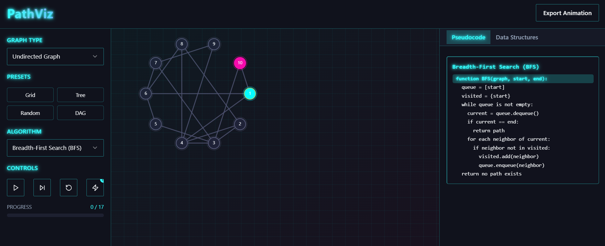

# 🌐 PathViz – Interactive Graph Algorithms Visualizer

> **PathViz** is a web-based interactive tool created **exclusively for visualizing graph algorithms**. With stunning visuals, real-time animations, and intuitive controls, it transforms abstract graph theory into a hands-on, visual learning journey.

---
## 🖼️ Preview



*This is how AlgoMorph looks in action.*

---
## 🎯 What is PathViz?

Graphs power everything from social networks to navigation, yet understanding how graph algorithms work can be challenging.  
**PathViz was built specifically to illuminate these algorithms** through rich, colorful animations and dynamic interactivity.

Whether you're a computer science student, teacher, or enthusiast, PathViz helps you visualize the invisible logic behind graph computations.

---

## ✨ Key Features (All About Graph Algorithms!)

- 🧭 **Step-by-Step Graph Algorithm Execution**
  Watch algorithms unfold live on directed, undirected, weighted, or unweighted graphs.

- 🎨 **Vibrant Visuals**
  Nodes and edges light up with vivid color schemes, glowing transitions, and theme modes (dark/light/custom skins).

- 🕹️ **Complete Interactivity**
  Drag nodes, edit graphs manually, or generate presets (grids, trees, random). Fully customizable graph structures.

- 🚀 **Graph Algorithms You Can Visualize**
  - **Traversals:** BFS, DFS  
  - **Shortest Path:** Dijkstra’s, A* Search, Bellman-Ford  
  - **Minimum Spanning Tree (MST):** Prim’s, Kruskal’s  
  - **Connectivity & Structure:** Tarjan’s SCC, Kosaraju’s, Topological Sort  
  - **All-Pairs Paths:** Floyd-Warshall

- 📊 **Live Data Structure Display**
  Visually track stacks, queues, heaps, and parent mappings as the algorithm runs.

- 🧠 **Educational Add-ons**
  - Pseudocode tracing (syncs with steps)
  - Export algorithm run as GIF or video

- 🧙‍♀️ **Themed Algorithm Worlds**
  Experience graph search in fantasy forests, neon mazes, underwater caves, or 3D space!

---


## 🚀 Getting Started
### Run Locally
```bash
git clone https://github.com/ju-baer/PathViz
cd PathViz
npm install
npm run dev

